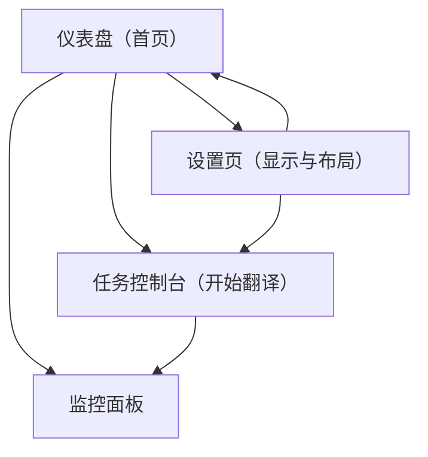

## 1. Product Overview
面向 AiNiee Web 控制台的整体 UI/布局优化，以提升可用空间、信息可读性与跨屏幕一致体验。
重点解决“控制台区域过窄/高度不足、信息密度与可读性、响应式布局、面板高度可配置与持久化”。

## 2. Core Features

### 2.1 Feature Module
本次 UI 优化需求由以下主要页面组成：
1. **仪表盘（首页）**：全局布局容器、内容宽度策略、卡片信息密度与对齐、全局可读性规范。
2. **任务控制台（开始翻译）**：控制台纵向空间分配、日志区域可配置高度、对比视图双栏可读性与溢出策略。
3. **监控面板**：窄高屏下可读性、关键指标优先级、表格/列表可滚动区、吸顶工具条。
4. **设置页（含显示/布局设置）**：新增“布局偏好”配置入口（内容宽度模式、控制台/面板默认高度、是否紧凑模式）。

### 2.2 Page Details
| Page Name | Module Name | Feature description |
|---|---|---|
| 仪表盘（首页） | 内容宽度策略 | 提供“自适应宽度/限制宽度”两种模式；默认在桌面端更宽（提升内容可用面积），避免主内容长期被固定在较窄 max-width 容器中。 |
| 仪表盘（首页） | 信息密度与可读性 | 统一字号层级、行高、卡片间距；对长文本/路径采用省略+悬浮提示；关键数值对比强化（颜色/字重/对齐）。 |
| 任务控制台（开始翻译） | 控制台高度不足修复 | 将页面高度计算从“固定扣减”改为“容器内自适应 + min-h-0 + 可滚动分区”；保证 Terminal/对比双栏可占满剩余空间。 |
| 任务控制台（开始翻译） | 面板高度可配置 | 支持用户调整“统计面板/日志面板/对比双栏”的默认高度或比例（拖拽分隔条或设置项），并在刷新后保持。 |
| 任务控制台（开始翻译） | 信息密度与阅读优化 | 提供“标准/紧凑”两种密度；日志行支持自动换行、路径断行；错误/警告层级更清晰（图标+颜色+可点击）。 |
| 任务控制台（开始翻译） | 响应式布局 | 桌面端双栏（对比视图）在宽屏下提升列宽并限制每行字符长度；小屏下自动变为上下堆叠，并保留独立滚动。 |
| 监控面板 | 关键区优先级与滚动 | 顶部关键状态区吸顶；下方表格/列表分区滚动；在高度不足时优先显示“状态/进度/错误摘要”。 |
| 监控面板 | 响应式与可读性 | 断点下切换布局（多列→单列）；表格列在小屏收起为摘要行；长字段省略并可展开。 |
| 设置页（含显示/布局设置） | 布局偏好入口 | 新增“显示与布局”分组：内容宽度模式、紧凑模式开关、日志默认高度/比例、对比视图默认布局等；提供“恢复默认”。 |
| 设置页（含显示/布局设置） | 偏好持久化 | 将布局偏好持久化（本地优先；可选同步到后端配置）；切换页面立即生效并写入。 |

## 3. Core Process
1) 你进入 Web 控制台后，默认使用“桌面端更宽的内容区”与更合理的纵向分区，任务页日志/对比区域可占满剩余高度。
2) 你在“任务控制台”可通过拖拽分隔条（或设置页）调整日志面板高度/比例；调整后立即生效并被保存。
3) 你在不同屏幕尺寸（窄屏/宽屏/低高度窗口）下，布局自动切换：双栏变单列、关键工具条吸顶、列表分区滚动，确保核心信息始终可读。

