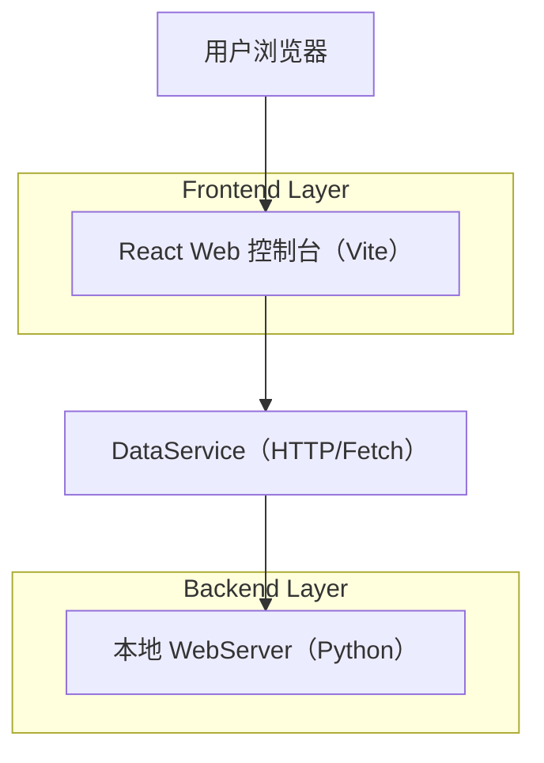
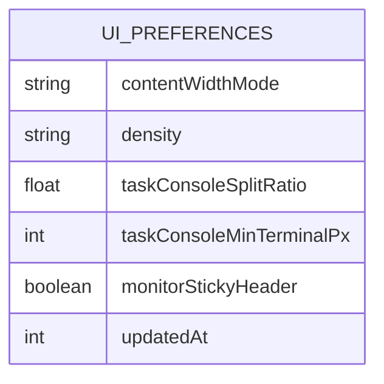

## 1.Architecture design


## 2.Technology Description
- Frontend: React@18 + TypeScript + tailwindcss + vite
- Backend: 项目内置 WebServer（Python，提供任务/配置/状态 API）
- Storage: localStorage（UI 偏好首选持久化）；可选扩展为后端配置文件持久化（不引入新服务）

## 3.Route definitions
| Route | Purpose |
|---|---|
| / | 仪表盘（首页），展示概览与入口 |
| /task | 任务控制台：启动任务、查看统计与日志、对比视图 |
| /monitor | 监控面板：只读监控与进度展示 |
| /settings | 设置页：新增“显示与布局”偏好项 |

## 4.API definitions (If it includes backend services)
### 4.1 Layout/UI 偏好（新增/扩展）
目标：支持“面板高度可配置 + 刷新保持 + 跨页面生效”。

建议方案（优先级从高到低）：
1) **localStorage 优先**：实现成本最低、无需改动后端；适合单机控制台。
2) **可选后端持久化**：在现有配置体系上增加 ui_preferences（适合多端/多人共用同一配置）。

TypeScript 公用类型：
```ts
export type ContentWidthMode = 'fluid' | 'contained';

export interface UiPreferences {
  contentWidthMode: ContentWidthMode; // 主内容宽度策略
  density: 'comfortable' | 'compact'; // 信息密度
  taskConsole: {
    // 以比例为主，避免不同屏幕绝对高度不一致
    splitRatio: number; // 0~1，StatsPanel:Terminal
    minTerminalPx: number; // 保底高度
  };
  monitor: {
    stickyHeader: boolean;
  };
  updatedAt: number;
}
```

若落地后端持久化，建议新增 API：
- `GET /api/ui/preferences`：读取 UiPreferences（无则返回默认）
- `PUT /api/ui/preferences`：全量更新 UiPreferences（服务端校验范围）

请求/响应示例：
```json
{
  "contentWidthMode": "fluid",
  "density": "compact",
  "taskConsole": { "splitRatio": 0.35, "minTerminalPx": 260 },
  "monitor": { "stickyHeader": true },
  "updatedAt": 1730000000
}
```

## 6.Data model(if applicable)
### 6.1 Data model definition


### 6.2 Data Definition Language
本次不引入数据库；默认使用 localStorage。
如需后端落盘，可将 UiPreferences 作为配置文件的一部分存储（例如 JSON），由 WebServer 读写。